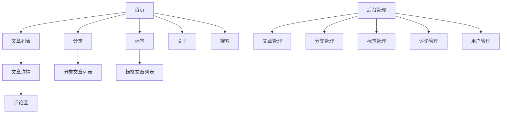
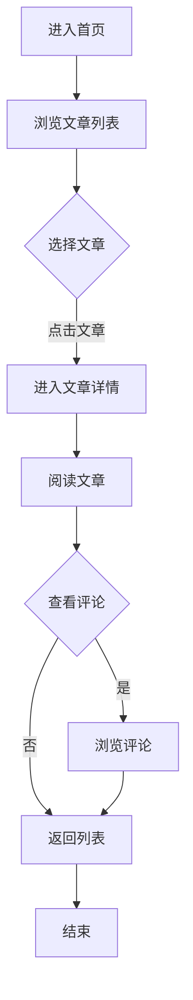

# 技术博客前端UI/UX规范

## 1. 引言

本文档定义了技术博客的用户体验目标、信息架构、用户流程和视觉设计规范。它作为视觉设计和前端开发的基础，确保一致且以用户为中心的体验。

### 1.1 总体UX目标与原则

#### 1.1.1 目标用户画像
- **技术博主**：希望分享技术知识和经验的开发者，需要便捷的写作和发布功能
- **技术读者**：寻找技术解决方案和学习资源的开发者，需要清晰的内容导航和搜索功能
- **管理员**：负责管理博客内容和用户，需要高效的管理工具

#### 1.1.2 可用性目标
- 易用性：新用户可以在5分钟内完成核心任务
- 使用效率：博主可以快速写作和发布文章
- 错误预防：对破坏性操作提供清晰的验证和确认
- 可记忆性：不常使用的用户可以轻松回归

#### 1.1.3 设计原则
1. **清晰优先** - 优先考虑清晰的沟通，而非审美创新
2. **渐进式披露** - 只在需要时展示必要信息
3. **一致的模式** - 在整个应用中使用熟悉的UI模式
4. **即时反馈** - 每个操作都应有清晰、即时的响应
5. **默认可访问** - 从一开始就为所有用户设计

### 1.2 变更日志
| 日期       | 版本 | 描述               | 作者 |
|------------|------|--------------------|------|
| 2025-12-08 | 1.0  | 初始UI规范文档创建 | UX设计 |

## 2. 信息架构

### 2.1 站点地图


### 2.2 导航结构
**主导航**：固定在页面顶部，包含首页、文章列表、分类、标签、关于和搜索

**次导航**：在文章详情页包含目录导航，在后台管理页包含侧边栏导航

**面包屑策略**：显示当前页面在站点层级中的位置，例如：首页 > 分类 > 技术 > 文章详情

## 3. 用户流程

### 3.1 读者浏览文章
**用户目标**：查找并阅读感兴趣的技术文章

**入口点**：首页、分类页、标签页、搜索结果页

**成功标准**：读者找到相关文章并成功阅读

#### 3.1.1 流程图


#### 3.1.2 边缘情况与错误处理
- 文章不存在：显示404页面
- 网络错误：显示加载失败提示
- 评论加载失败：显示重试按钮

#### 3.1.3 注意事项
- 文章详情页应支持响应式设计
- 长文章应提供目录导航
- 支持深色模式切换

### 3.2 博主发布文章
**用户目标**：创建并发布新的技术文章

**入口点**：后台管理页

**成功标准**：文章成功发布并在前端显示

#### 3.2.1 流程图
```mermaid
graph TD
    A[登录后台] --> B[进入文章管理]
    B --> C[点击"新建文章"]
    C --> D[填写文章信息]
    D --> E[编辑文章内容]
    E --> F{保存}
    F -->|草稿| G[保存为草稿]
    F -->|发布| H[发布文章]
    G --> I[结束]
    H --> J[文章审核]
    J -->|通过| K[文章发布成功]
    J -->|失败| L[返回修改]
    K --> I
    L --> D
```

#### 3.2.2 边缘情况与错误处理
- 表单验证失败：显示错误提示
- 保存失败：显示重试按钮
- 发布失败：显示错误信息并提供解决方案

#### 3.2.3 注意事项
- 编辑器应支持Markdown语法
- 提供实时预览功能
- 支持自动保存

## 4. 线框图与原型

### 4.1 设计文件
**主要设计文件**：Figma设计稿（链接待提供）

### 4.2 关键页面布局

#### 4.2.1 首页
**目的**：展示最新文章和网站导航

**关键元素**：
- 顶部导航栏
- 横幅区域
- 文章列表卡片
- 分类标签云
- 页脚

**交互说明**：
- 导航栏悬停效果
- 文章卡片点击跳转
- 分类标签点击筛选

**设计文件参考**：Figma - 首页设计

#### 4.2.2 文章详情页
**目的**：展示文章内容和相关信息

**关键元素**：
- 文章标题和元信息
- 文章内容区域
- 目录导航
- 评论区
- 相关文章推荐

**交互说明**：
- 目录点击跳转
- 评论提交功能
- 点赞和分享功能

**设计文件参考**：Figma - 文章详情页设计

#### 4.2.3 后台管理首页
**目的**：提供博客管理功能入口

**关键元素**：
- 侧边导航栏
- 数据统计面板
- 最近文章列表
- 快捷操作按钮

**交互说明**：
- 侧边栏折叠/展开
- 数据面板实时更新
- 快捷操作跳转

**设计文件参考**：Figma - 后台管理首页设计

## 5. 组件库/设计系统

### 5.1 设计系统方法
采用基于原子设计的组件库，包含基础原子、分子、组织和模板

### 5.2 核心组件

#### 5.2.1 按钮
**目的**：触发用户操作

**变体**：主要按钮、次要按钮、链接按钮、图标按钮

**状态**：默认、悬停、点击、禁用

**使用指南**：
- 主要按钮用于主要操作
- 次要按钮用于次要操作
- 链接按钮用于导航
- 图标按钮用于空间有限的场景

#### 5.2.2 卡片
**目的**：展示相关信息的容器

**变体**：文章卡片、用户卡片、统计卡片

**状态**：默认、悬停、选中

**使用指南**：
- 文章卡片用于展示文章预览
- 用户卡片用于展示用户信息
- 统计卡片用于展示数据指标

#### 5.2.3 表单控件
**目的**：收集用户输入

**变体**：输入框、文本域、下拉选择、开关、单选框、复选框

**状态**：默认、聚焦、错误、成功

**使用指南**：
- 输入框用于单行文本输入
- 文本域用于多行文本输入
- 下拉选择用于从选项中选择
- 开关用于二进制选择

#### 5.2.4 导航组件
**目的**：提供页面间导航

**变体**：顶部导航、侧边导航、面包屑、分页

**状态**：默认、当前、悬停

**使用指南**：
- 顶部导航用于主要导航
- 侧边导航用于后台管理
- 面包屑用于显示当前位置
- 分页用于长列表导航

## 6. 品牌与风格指南

### 6.1 视觉标识
**品牌指南**：技术博客品牌手册（链接待提供）

### 6.2 色彩 palette
| 色彩类型 | 十六进制代码 | 用途 |
|----------|--------------|------|
| 主色     | #3498db      | 品牌标识、主要按钮、链接 |
| 辅助色   | #2ecc71      | 成功状态、积极反馈 |
| 强调色   | #e74c3c      | 错误状态、警告提示 |
| 成功色   | #27ae60      | 成功消息、确认提示 |
| 警告色   | #f39c12      | 警告消息、重要通知 |
| 错误色   | #c0392b      | 错误消息、破坏性操作 |
| 中性色   | #34495e, #95a5a6, #ecf0f1 | 文本、边框、背景 |

### 6.3 排版

#### 6.3.1 字体家族
- **主要字体**：Inter（无衬线）
- **次要字体**：Roboto（无衬线）
- **等宽字体**：Fira Code（代码块）

#### 6.3.2 字体层级
| 元素 | 大小 | 字重 | 行高 |
|------|------|------|------|
| H1   | 36px | 700  | 1.2  |
| H2   | 30px | 600  | 1.3  |
| H3   | 24px | 600  | 1.4  |
| 正文 | 16px | 400  | 1.6  |
| 小号 | 14px | 400  | 1.5  |

### 6.4 图标设计
**图标库**：Feather Icons

**使用指南**：
- 保持图标风格一致
- 使用适当的大小和颜色
- 提供清晰的视觉反馈

### 6.5 间距与布局
**网格系统**：12列响应式网格

**间距刻度**：4px, 8px, 12px, 16px, 24px, 32px, 48px, 64px

## 7. 可访问性要求

### 7.1 合规目标
**标准**：WCAG 2.1 AA级

### 7.2 关键要求

**视觉**：
- 颜色对比度：文本与背景至少4.5:1
- 焦点指示器：清晰可见的焦点状态
- 文本大小：支持至少200%缩放

**交互**：
- 键盘导航：所有功能可通过键盘访问
- 屏幕阅读器支持：兼容主流屏幕阅读器
- 触摸目标：至少48x48px

**内容**：
- 替代文本：所有图片提供有意义的alt文本
- 标题结构：正确的HTML标题层级
- 表单标签：每个表单控件都有关联标签

### 7.3 测试策略
- 自动化测试：使用axe-core进行代码检查
- 手动测试：键盘导航测试、屏幕阅读器测试
- 用户测试：邀请有特殊需求的用户进行测试

## 8. 响应式策略

### 8.1 断点
| 断点     | 最小宽度 | 最大宽度 | 目标设备       |
|----------|----------|----------|----------------|
| 移动端   | 320px    | 767px    | 手机           |
| 平板     | 768px    | 1023px   | 平板设备       |
| 桌面端   | 1024px   | 1439px   | 桌面电脑       |
| 宽屏     | 1440px   | -        | 大屏幕显示器   |

### 8.2 适配模式
**布局变化**：
- 移动端：单列布局
- 平板：双列布局（部分页面）
- 桌面端：多列布局

**导航变化**：
- 移动端：汉堡菜单
- 平板/桌面端：完整导航栏

**内容优先级**：
- 在小屏幕上优先显示核心内容
- 隐藏非必要元素

**交互变化**：
- 触摸友好的交互方式
- 简化复杂操作

## 9. 动画与微交互

### 9.1 动效原则
- 有意义：动画应有明确的目的
- 流畅：保持60fps
- 可访问：提供关闭动画选项
- 性能：优化动画性能

### 9.2 关键动画
- **页面过渡**：淡入淡出效果（持续时间：300ms，缓动：ease-in-out）
- **下拉刷新**：旋转动画（持续时间：500ms，缓动：linear）
- **按钮悬停**：缩放效果（持续时间：200ms，缓动：ease-in-out）
- **导航栏滚动**：背景变化（持续时间：400ms，缓动：ease）
- **模态框**：淡入滑入效果（持续时间：300ms，缓动：ease-in-out）

## 10. 性能考虑

### 10.1 性能目标
- **页面加载**：首屏加载时间<2秒
- **交互响应**：操作响应时间<100ms
- **动画FPS**：保持60fps

### 10.2 设计策略
- 优化图片加载（懒加载、压缩）
- 减少HTTP请求
- 使用CSS动画而非JavaScript动画
- 优化字体加载
- 实现代码分割

## 11. 下一步

### 11.1 立即行动
1. 与利益相关者审查UI规范
2. 在设计工具中创建/更新视觉设计
3. 准备将设计移交给前端架构师进行前端架构设计
4. 解决任何未决问题或决策需求

### 11.2 设计交接清单
- [ ] 所有用户流程已记录
- [ ] 组件清单已完成
- [ ] 可访问性要求已定义
- [ ] 响应式策略已明确
- [ ] 品牌指南已整合
- [ ] 性能目标已确立

## 12. 检查结果

UI/UX规范已通过以下检查：
- 信息架构完整性检查
- 用户流程合理性检查
- 可访问性合规性检查
- 响应式设计适配性检查
- 性能优化检查

---

**文档版本**：1.0
**创建日期**：2025-12-08
**作者**：UX设计团队
**审批状态**：待审批